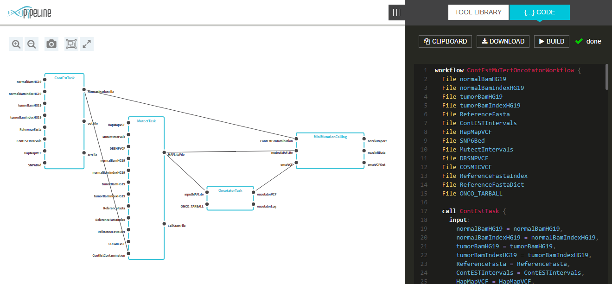

[](https://travis-ci.org/epam/pipeline-builder)
[](https://coveralls.io/github/epam/pipeline-builder?branch=dev)

# Pipeline Builder

Pipeline Builder is a JavaScript library for visualizing and constructing bioinformatics workflows, using  Workflow Description Language (WDL)

* Visualization of WDL scripts [https://github.com/broadinstitute/wdl](https://github.com/broadinstitute/wdl)
* Visual editor for creation and customization of a bioinformatics workflow, composed from a set of tools
* Generation of a WDL (Workflow Definition Language) script for the workflow
* Integration API into on-premises and cloud workflow environments



## Demo environment

Example of a **Pipeline Builder** usage is available at [http://pb.opensource.epam.com](http://pb.opensource.epam.com)

This demo application demonstrates major capabilities of a **Pipeline Builder**

Description of the demo application is available at [Demo application manual](docs/general/demo-app-manual.md)

## Installation and Usage

Install `pipeline-builder` the usual way:

```sh
npm install --save pipeline-builder
```

Then require it

```js
const pipeline = require('pipeline-builder');
console.log(pipeline.VERSION);
```

Refer to the [API docs and tutorials](docs/tutorials) for more details.

## Contribution

Ensure that the latest [git](https://git-scm.com/)
(e.g [Git For Windows](https://git-for-windows.github.io/)) and
[Node.js v6 LTS](https://nodejs.org/) are installed. You're also encouraged to use
[Yarn](https://yarnpkg.com/) package manager to guarantee that package versions are consistent across
all build machines.
[Gulp.js v3](http://gulpjs.com/) is used as a build framework.

```sh
# grab the project
git clone https://github.com/epam/pipeline-builder.git

# install necessary Node.js modules
cd pipeline-builder
yarn global add gulp-cli
yarn install

# test and build everything
gulp

# or just start webpack development server with live reload
gulp serve
```
