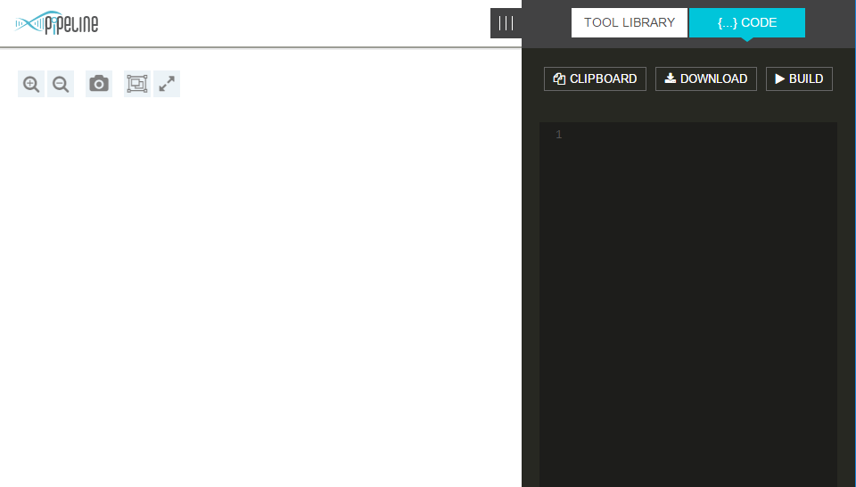
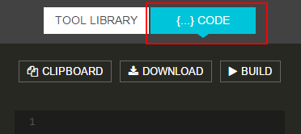
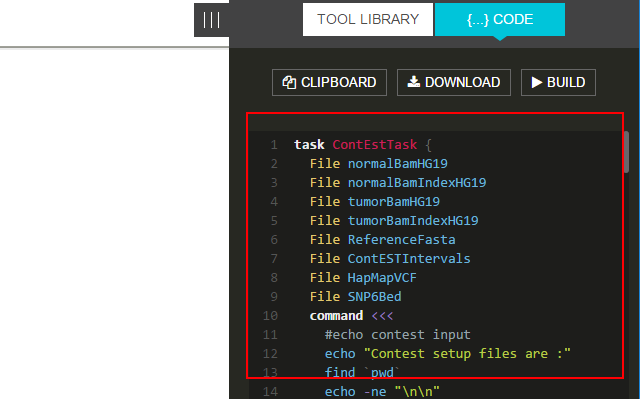
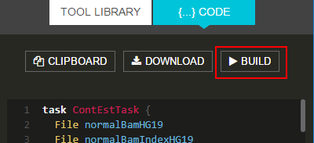
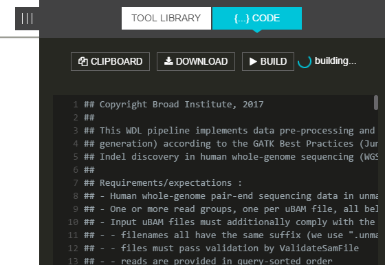
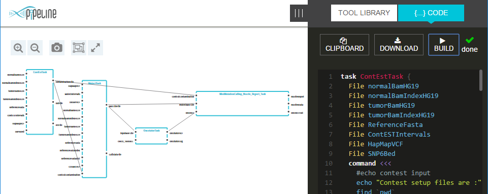

# Visualizing existing WDL script

When an application is loaded for the first time - no pipeline visual representation will be shown, as no WDL script is loaded

To visualize a graph the following operations should be performed
* Load [http://pb.opensource.epam.com](http://pb.opensource.epam.com) into a web-browser. A blank canvas will be shown

* Select `Code` tab in a `Pipeline script` toolbar

* Type or paste a WDL script into a text editor

* Click `Build` button

* If a WDL script represents a large workflow (e.g. [PublicPairedSingleSampleWf_170412.wdl](https://raw.githubusercontent.com/broadinstitute/wdl/develop/scripts/broad_pipelines/PublicPairedSingleSampleWf_170412.wdl)) building can take several seconds to finish. In this case `building...` message will be shown next to `Build` button in a `Code` panel

* `Pipeline visualization` canvas will show an appropriate graph (if a WDL script contains any issues - an error message will be shown)

